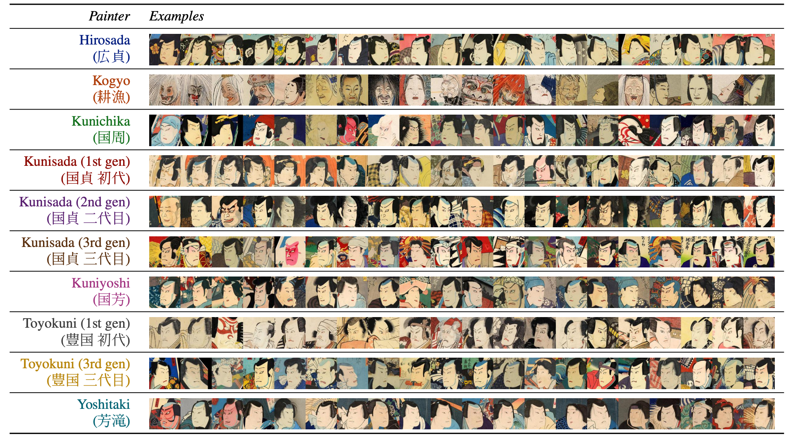
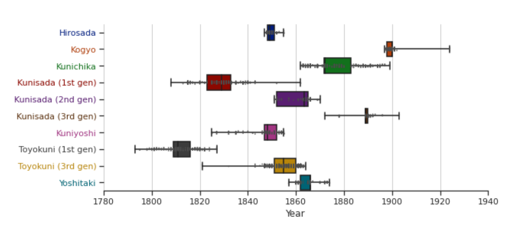
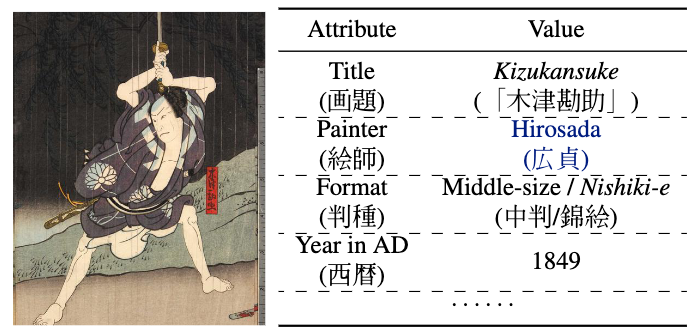
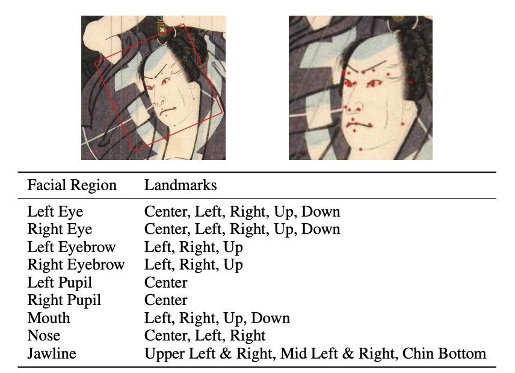

# ARC Ukiyo-e Faces Dataset

[](https://creativecommons.org/licenses/by/4.0/) 

📚 Read the [paper](https://arxiv.org/abs/2106.02267) to learn more about our work ARC Ukiyo-e Faces Dataset. The paper is accepted for Twelfth International Conference on Computational Creativity, ICCC’21. 

For running scripts in this repo, it is recommended to set up a Python Virtual Environment with Python version >= 3.6 using [conda](https://conda.io/) or [venv](https://docs.python.org/3/library/venv.html), install required dependencies with `pip install -r requirements.txt`. You may also need to  install [PyTorch](https://pytorch.org/get-started/locally/) and [TensorFlow](https://www.tensorflow.org/install).

## The Dataset

We present ARC Ukiyo-e Faces Dataset, a large-scale (>10k paintings, >20k faces) Ukiyo-e dataset with coherent semantic labels and geometric annotations through augmenting and organizing existing datasets with automatic detection. Our work is mainly baed on ARC Ukiyo-e Collection, as we describe below.

<p align="center" vertical-align="middle">
    
    
</p>

<p align="center">
  Ukiyo-e paintings associated with their authors as well as distribution of years with respect to these authors in our dataset. 
  We show here ten authors with the most painting in our dataset.
</p>

### ARC Ukiyo-e Collection

**Overview**. [ARC Ukiyo-e Collection (ARC所蔵浮世絵データベース)](https://www.dh-jac.net/db/nishikie/) is a publicly available service that provides access to digitized Ukiyo-e paintings primarily in the Edo period, plus metadata compiled by domain experts.

**Metadata**. 
ARC has 11,103 entries of painting and the associated metadata, one example of which is shown in Figure 1 below.

<p align="center">
  
  <br>
  <strong>Figure 1.</strong> An example of Ukiyo-e work (Object Number arcUP2451) titled <em>Kizukansuke</em> by painter <em style="color:rgb(0, 28, 128);">Hirosada</em>.
</p>

We also provide metadata from ARC in `resource/arc_metadata.csv` in comma-separated values file format where the first row is the header to each of the columns. 
A detailed explanation of these columns' semantics can be found in [Batjargal et al.](https://dcpapers.dublincore.org/pubs/article/view/3635), so we only briefly explain them here:

```
ACNo. (ARC collection Number), 画題等 (Print title), 画題２ (Picture name), 役名.代.役者 (Official title), 版元文字 (Text),  版元1 (Publisher), 判種 (Format), 続方向 (Direction), 落款印章 (Seal), 絵師 (Painter), 改印等 (revised seals), 西暦 (Year in A.D.), 和暦 (Year in Japanese Calender), 地域 (Region), 劇場 (Theater), 外題 (Title of play), 外題よみ (Reading of Title of play), 所作題 (Performed title), 所作題よみ (Reading of Performed title), 主外題 (Main performed title), 系統分類題 (Classification title), 所蔵 (Library), 画中文字 (Text), homeURL (URL of corresponding ARC page), SmallImageURL (URL to the small image), LargeImageURL (URL to the large image), filename (Filename used to saved the large image).
```

**Annotations**: 
We provide annotations (facial landmarks) for ARC in `resources/arc_face.csv`. These facial landmarks are detected using a face recognition API, [AWS Rekognition](https://aws.amazon.com/rekognition/) on ARC paintings, and the semantics of facial landmarks are detailed in AWS Rekognition's [Documents](https://docs.aws.amazon.com/rekognition/latest/dg/API_Landmark.html). We further infer the possibly rotated bounding box of faces for cropping faces from the painting, inspired by the preprocessing in [FFHQ](https://openaccess.thecvf.com/content_CVPR_2019/papers/Karras_A_Style-Based_Generator_Architecture_for_Generative_Adversarial_Networks_CVPR_2019_paper.pdf). See Figure 2 below for an example of facial landmarks and inferred bounding box of the face.

<p align="center">
  
  <br>
  <strong>Figure 2</strong>. An example of detected landmarks and the extracted face in Figure 1’s Ukiyo-e painting. 
  On the left, the red dots show detected facial landmarks and the rectangle shows the bounding box inferred from these landmarks. 
  The right image shows the extracted face from the bounding box.
  The table lists a summary of all landmark locations.
</p>

## Download the Images 💾

🌟 You can **manually** download ARC Ukiyo-e Collection images by running:
```bash
# Download ARC Ukiyo-e Collection images. 
python3 arc_download.py
```

By default, it downloads images into `./scratch/arc_images/*.jpg` and copy annotations/metadata to `./scratch/arc_face.csv` and `./scratch/arc_metadata.csv`. Consult the output of `python3 arc_download.py --help` for how to change the default behavior.

Please note that we **intentionally** did not include image data into the dataset to allow image providers to check which images are used and respect the original authors. We request not to create a derived dataset including image data for the user's convenience.

## Extract and Visualize Faces

🌟 We also provide scripts for extracting and visualizing the faces using the annotation. Assuming datasets have been downloading in the places mentioned above, faces can be extracted as follows:

```bash
# Extract faces for ARC dataset
python3 face_extract.py                                               \
  --images_dir              ./scratch/arc_images/                     \
  --face_landmarks_file     ./scratch/arc_face.csv                    \
  --arc_metadata_file       ./scratch/arc_metadata.csv                \
  --new_images_dir          ./scratch/arc_extracted_face_images       \
  --new_face_landmarks_file ./scratch/arc_extracted_face_face.csv     \
  --new_arc_metadata_file   ./scratch/arc_extracted_face_metadata.csv \
  --new_size 256 \
  ;
```

Note that the face extraction process also generates new landmarks/metadata files adjusted to the faces (e.g., the landmark coordinates are adjusted for the extracted faces), enabling more straightforward further analysis.

🌟 Furthermore, faces can also be visualized as follows, drawing landmarks and inferred bounding boxes for each face.
```bash
# Visualize faces for ARC dataset
python3 face_viz.py                                        \
  --images_dir              ./scratch/arc_images/          \
  --out_images_dir          ./scratch/arc_face_viz_images  \
  --face_landmarks_file     ./scratch/arc_face.csv         \
  --draw_inferred_box                                      \
  ;
```


## Color Separation of Ukiyo-e
We study Ukiyo-e style by framing it as a [soft color segmentation](http://yaksoy.github.io/scs/) problem and use state-of-the-art [Fast Soft Color Separation (FSCS)](https://openaccess.thecvf.com/content_CVPR_2020/html/Akimoto_Fast_Soft_Color_Segmentation_CVPR_2020_paper.html) for efficient processing. 
A few scripts, adapted from [FSCS code](https://github.com/pfnet-research/FSCS)], are provided to deal with Ukiyo-e paintings.

🌟 The following example of color separation reproduces the results reported in Figure 9 in our paper.

```bash
# Invoke FSCS to separate colors of Ukiyo-e painting.
python3 ./fscs/infer.py                                    \
  --in_image      ./images/sample/ukiyo-e-whole.jpg        \
  --out_dir       ./scratch/fscs/ukiyo-e-whole             \
  ;
```

## Line Sketch Extraction of Ukiyo-e

We use [sketchKeras](https://github.com/lllyasviel/sketchKeras) for line sketch extraction.
A few scripts, adapted from [sketchKeras code](https://github.com/lllyasviel/sketchKeras)], are provided to deal with Ukiyo-e paintings.

🌟 For example, frist download the [officlal pre-trained model](https://github.com/lllyasviel/sketchKeras/releases/tag/0.1) and save it to './sketchkerras/mod.h6'. Then invoke the script as follows.

```bash
# Invoke sketchKeras to extract linke sketch from a Ukiyo-e painting.
python3 ./sketchkerras/infer.py                            \
  --in_image      ./images/sample/ukiyo-e-whole.jpg        \
  --out_image     ./scratch/sketchkerras/ukiyo-e-whole.jpg \
  ;
```


## Other datasets

Our work can be extended with [Ukiyo-e Faces Dataset](https://www.justinpinkney.com/ukiyoe-dataset/), a publicly available dataset of Ukiyo-e faces extracted from Ukiyo-e images available online.
With 5k high-quality faces, this dataset plays an essential role in [controllable image generation across Ukiyo-e faces and photo-realistic human faces](https://www.justinpinkney.com/stylegan-network-blending/).
Although it **does not come with metadata**, we still could detect annotations (facial landmarks) and provide them in `resources/ufd_face.csv` using the same pipeline mentioned above. This provides a valuable extension to our work. 

🌟 You can **manually** download Ukiyo-e Faces Dataset from [its source](https://www.justinpinkney.com/ukiyoe-dataset/) and place images into `./scratch/ufd_images/*.jpg`. You may also copy the annotations using `cp ./resource/ufd_face.csv ./scratch/ufd_face.csv`. There is no `*_metadata.csv` avaiable since it does not come with metadata.

🌟 You can also extract and visualize faces from Ukiyo-e Faces Dataset by invoking the following scripts:
```bash
# Extract faces for Ukiyo-e dataset.
python3 face_extract.py                                               \
  --images_dir              ./scratch/ufd_images/                     \
  --face_landmarks_file     ./scratch/ufd_face.csv                    \
  --new_images_dir          ./scratch/ufd_extracted_face_images       \
  --new_face_landmarks_file ./scratch/ufd_extracted_face_face.csv     \
  --new_size 256 \
  ;

# Visualize faces for Ukiyo-e dataset.
python3 face_viz.py                                        \
  --images_dir              ./scratch/ufd_images/          \
  --out_images_dir          ./scratch/ufd_face_viz_images  \
  --face_landmarks_file     ./scratch/ufd_face.csv         \
  --draw_inferred_box                                      \
  ;
```

For Ukiyo-e Faces Dataset, please cite and attribute accordingly as [instructed by its creator](https://www.justinpinkney.com/ukiyoe-dataset/).


## License and Citation

### License

"ARC Ukiyo-e Faces Dataset" (Created by Yingtao Tian and ROIS-DS CODH; Collected from ARC) is licensed under [Creative Commons Attribution 4.0 International License (CC BY)](https://creativecommons.org/licenses/by-sa/4.0/).

There are a few exceptions: contents under `./fcsc` are adapted from [FSCS code](https://github.com/pfnet-research/FSCS) and therefore are under the original MIT License; contents under `./sketchkerras` are adapted from [sketchKeras code](https://github.com/lllyasviel/sketchKeras) and therefore are under the original Apache License.

### Citation

When you publish your creative work (e.g. paper), the following credit is required under the CC BY license.

**When you use the annotation data**, please cite the following.
  > "ARC Ukiyo-e Faces Dataset" (Created by Yingtao Tian, ROIS-DS CODH; Collected from ARC）, [https://doi.org/10.20676/00000394](https://doi.org/10.20676/00000394)
 
**When you use the metadata or images**, please cite the following in addition to above.
  > Art Research Center, Ritsumeikan University (2020): ARC Ukiyo-e database. Informatics Research Data Repository, National Institute of informatics. (dataset). [https://doi.org/10.32130/rdata.2.1](https://doi.org/10.32130/rdata.2.1)

Here the metadata is distributed within the ARC Ukiyo-e Faces Dataset with a permission from Art Research Center, Ritsumeikan University.

**When you refer to research on the dataset**, please cite the following in addition to above.

*[Ukiyo-e Analysis and Creativity with Attribute and Geometry Annotation. Yingtao Tian et al.](https://arxiv.org/abs/2106.02267)*

```
@inproceedings{tian2021ukiyoe,
  Author = {Yingtao Tian and Tarin Clanuwat and Chikahiko Suzuki and Asanobu Kitamoto},
  Title = {Ukiyo-e Analysis and Creativity with Attribute and Geometry Annotation},
  booktitle  = "Proceedings of the International Conference on Computational Creativity",
  year  = "2021",
}
```

## More Information

You can get more information about digital Ukiyo-e research in [Ukiyo-e Face Datasets](http://codh.rois.ac.jp/ukiyo-e/face-dataset/"), [ROIS-DS Center for Open Data in the Humanities](http://codh.rois.ac.jp/). 
